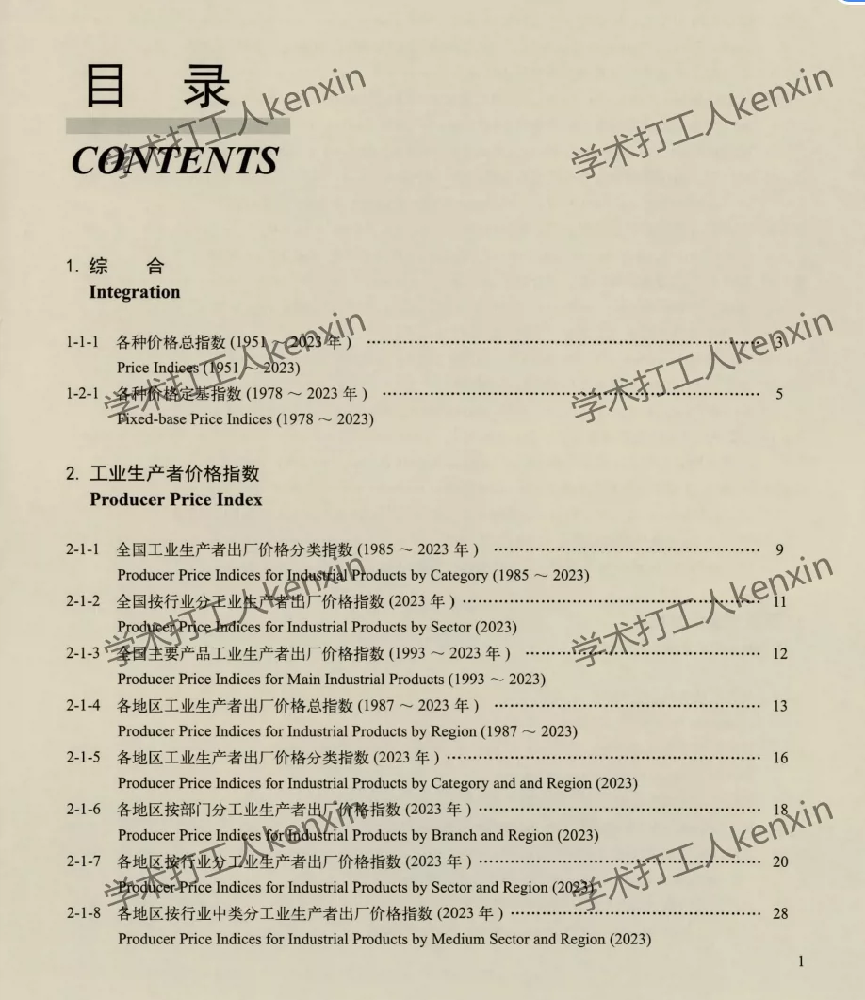
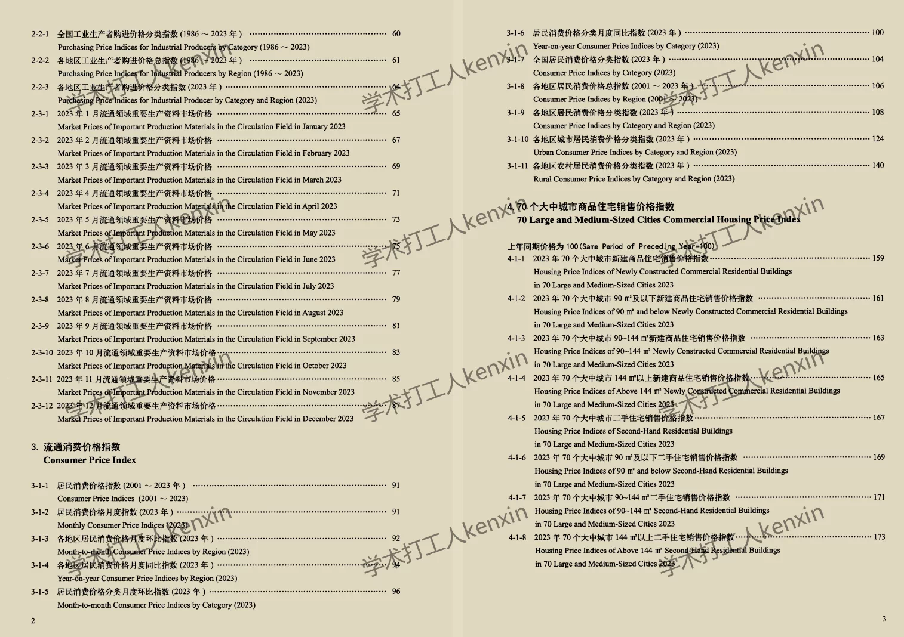
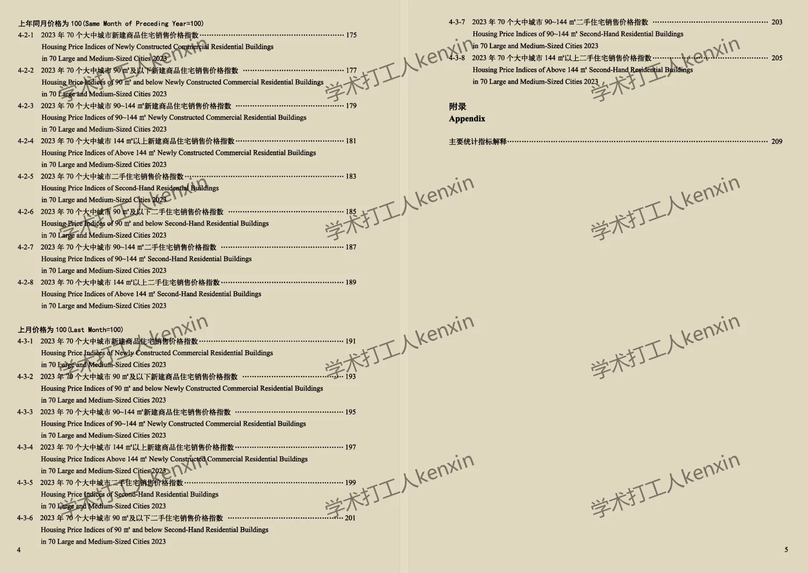
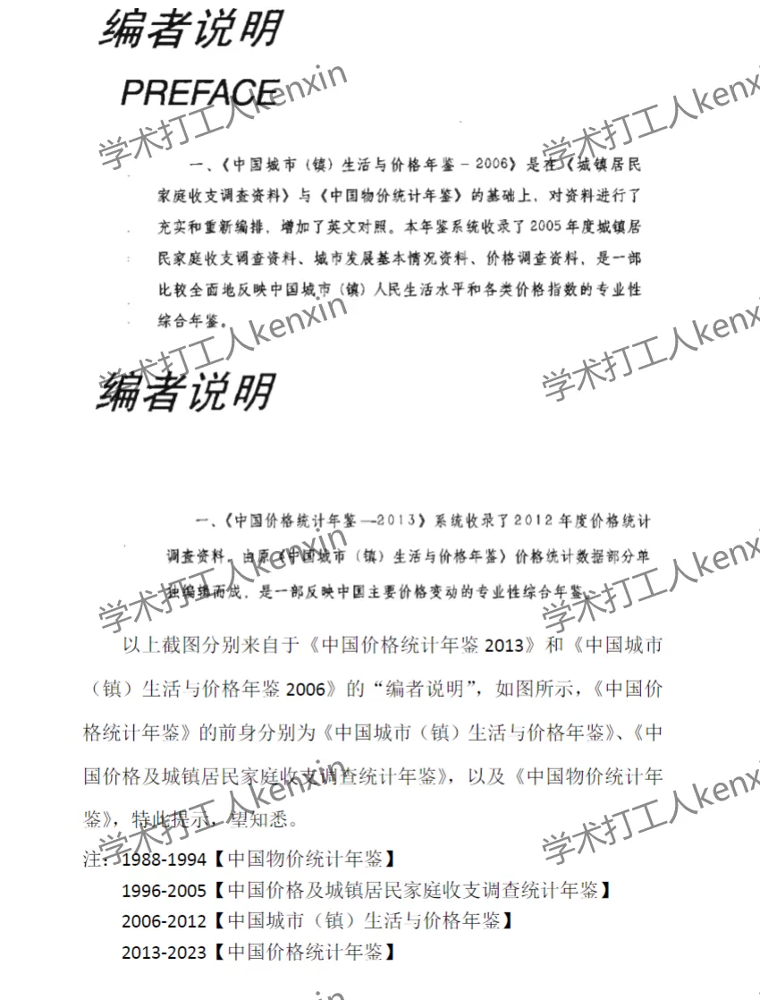

## Body

《China Price Statistics Yearbook》（1988-2025）

Data Year: The title year is the year the data was compiled, so the data year needs to be one less than the title year.
See the image below for a complete display of the description, please confirm if you need it before purchasing! After shipping, no returns or exchanges will be accepted for any reason!

01. Data Introduction
The China Price Statistics Yearbook

02. Indicator Details
(1) The directory is shown in the image, please take your time to view and purchase according to your needs. There are many indicators, and I can't help you find them. All information is here, but after shipping, there will be no return or exchange without any reason.
(2) The displayed directory is for 2024, due to limited space, only some parts are shown. The statistical methods may change from year to year. Academic common sense, the data year recorded in statistical materials is the previous year's data, which is also an academic common sense, hope everyone understands.
(3) The EXCEL format data is organized from original materials, including the content of the original material data, without the text content of the original material.
(4) If the data is placed in a zip file, you need to save the zip file first, then download, then unzip.
(5) If there is Excel protection, you can select all and copy to a new sheet to use.

## Images

item_1069763127823

Here is a pay link on Stripe ( https://buy.stripe.com/3cs8yP7sY87d0vu9AB ). Please contact me lonlonago@foxmail.com after funding $89, and I will send you a complete data files , thank you!

